```mermaid
classDiagram
    %% í´ë˜ìŠ¤ 관계 ì •ì˜
    Team "1" -- "*" Member : contains
    Member "*" -- "*" Skill : has
    Member "1" -- "*" Project : participates
    Member "1" -- "*" Guestbook : receives

    class Member {
        +String id
        +String name
        +String englishName
        +String role
        +String mbti
        +String email
        +String introduction
        +List~Link~ socialLinks
        +Image profilePhoto
        +joinTeam(Team)
        +updateProfile()
    }

    class Team {
        +String id
        +String name
        +String slogan
        +String description
        +List~Member~ members
        +addMember()
    }

    class Skill {
        +String id
        +String name
        +String category
        +String proficiency
    }

    class Project {
        +String id
        +String title
        +String description
        +Date startDate
        +Date endDate
        +List~String~ stack
    }

    class Guestbook {
        +String id
        +String fromName
        +String content
        +Date createdAt
        +Member toMember
    }
```

# 팀원 소개 앱 클래스 다이어그램 (Team Introduction App Class Diagram)

노션(Notion)을 활용한 팀원 소개 앱 개발을 위한 클래스 다이어그램입니다.
이 다이어그램은 앱의 데이터 구조를 나타내며, 노션 데이터베이스(Database)로 구현 시 필요한 속성(Property) 매핑 정보도 포함하고 있습니다.

## 1. 클래스 다이어그램 (Mermaid)

## 2. 노션 데이터베이스 설계 매핑 (Implementation Guide)

위 클래스 구조를 노션 데이터베이스로 구현할 때의 추천 속성(Property) 설정입니다.

### 🧑 Member (팀원 DB)
| 클래스 필드 | 노션 속성 유형 (Property Type) | 비고 |
|--- |--- |--- |
| **Name** | 제목 (Title) | 팀원 이름 |
| **Role** | 선택 (Select) | Leader, Developer, Designer 등 |
| **MBTI** | 선택 (Select) | 16, ENFP, INTJ 등 |
| **Team** | 관계형 (Relation) | Team DB와 연결 |
| **Skills** | 다중 선택 (Multi-select) | 또는 Skill DB와 Relation |
| **Photo** | 파일 및 미디어 (Files & media) | 프로필 사진 |
| **Github/Blog** | URL | 링크 정보 |
| **Projects** | 관계형 (Relation) | Project DB와 연결 |

### 🏢 Team (팀 DB)
| 클래스 필드 | 노션 속성 유형 (Property Type) | 비고 |
|--- |--- |--- |
| **Name** | 제목 (Title) | 팀 이름 (예: 개발 1팀) |
| **Members** | 관계형 (Relation) | Member DB와 연결 |
| **Description** | 텍스트 (Text) | 팀 소개글 |

### 🛠️ Project (프로젝트 DB)
| 클래스 필드 | 노션 속성 유형 (Property Type) | 비고 |
|--- |--- |--- |
| **Title** | 제목 (Title) | 프로젝트 명 |
| **Status** | 상태 (Status) | 진행중, 완료 등 |
| **Period** | 날짜 (Date) | 시작일 ~ 종료일 |
| **Participants**| 관계형 (Relation) | Member DB와 연결 |
