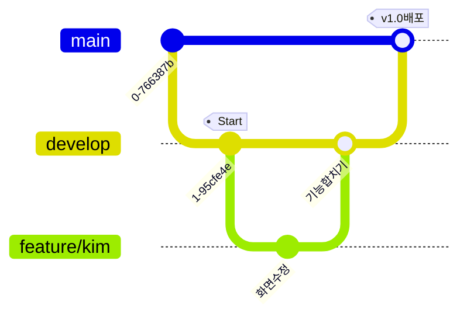

# 🐙 깃허브 협업 가이드 (For Team Leader & Members)

우리 팀은 **Git Flow**를 아주 단순하게 줄여서 사용합니다.
팀장님이 **Main**과 **Develop** 브랜치를 관리하고, 팀원들은 각자 작업을 해서 합치는 방식입니다.

## 1. 브랜치 전략 (Branch Strategy)

*   **👑 Main (메인)**: 언제든 배포 가능한 **"완성본"** 상태. (팀장만 건드림)
*   **🛠️ Develop (디벨롭)**: 개발 중인 기능들이 모이는 **"작업장"**. (팀장 관리)
*   **✨ Feature (기능)**: 각 팀원이 작업하는 **"개인 작업대"**. (여기서 맘껏 수정)



## 2. 팀장님의 역할 (Leader's Workflow)

1.  **초기 세팅**: 레포지토리 만들고 `main`, `develop` 브랜치 생성해서 올리기.
2.  **코드 합치기 (Merge)**: 팀원이 "다 했어요!" 하면 PR(Pull Request) 보고 `develop`에 합쳐주기.
3.  **버전 배포**: `develop`에서 테스트 다 끝나면 `main`으로 합쳐서 배포하기.

## 3. 팀원들의 역할 (Member's Workflow)

### ① 작업 시작할 때
```bash
# 1. 내 컴퓨터로 가져오기 (처음에만)
git clone [레포지토리 주소]

# 2. develop 브랜치로 이동
git checkout develop

# 3. 최신 상태 받아오기 (습관처럼 하기!)
git pull origin develop

# 4. 내 작업 전용 브랜치 만들기 (이름: feature/본인이름_기능)
git checkout -b feature/minji_login
```

### ② 작업 끝내고 올릴 때
```bash
# 1. 저장하기
git add .
git commit -m "로그인 화면 디자인 완성"

# 2. 내 브랜치를 깃허브에 올리기
git push origin feature/minji_login
```
👉 **이후 깃허브 웹사이트 가서 "Pull Request" 버튼 누르기!** (Leader에게 합쳐달라고 요청)

---

### ④ 내 정보 추가하기 (How to add myself)
1.  **`members.js` 파일 열기**: 프로젝트 폴더에서 이 파일을 엽니다.
2.  **내 데이터 추가**: 기존 팀원(김철수 등)의 코드를 복사해서, 맨 아래에 붙여넣고 내 정보로 수정합니다.
3.  **확인**: `index.html`을 더블 클릭해서 내 카드가 잘 뜨는지 확인합니다.
4.  **커밋 & 푸시**: 확인했으면 위 "작업 끝내고 올릴 때" 순서대로 깃허브에 올립니다.

---

## 💡 주의사항 (Rules)
1.  **Main 브랜치에는 절대 바로 푸시하지 않기!** (실수 방지)
2.  **Commit 메시지는 한글로 명확하게!** (예: `로그인 버튼 색상 변경`, `박민수 정보 추가`)
3.  **에러 나면 당황하지 말고 팀장님 호출!**
