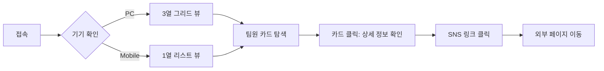

# 📝 팀원 소개 프로젝트 요구사항 정의서 (Revised)

## 1. 문서 개요 (Document Overview)
본 문서는 우리 스터디 팀의 정보를 효과적으로 공유하고 협업 효율을 높이기 위한 웹 애플리케이션 **'Team Flow'**의 개발을 위한 상세 요구사항을 정의한다. 앞서 제안된 '페르소나 가이드'의 복잡한 기능을 배제하고, 현재 구현 가능한 범위(MVP)에 집중하여 재작성하였다.

---

## 2. 문제 정의 (Problem Statement)
현재 우리 팀은 노션이나 메신저를 통해 파편적으로 소통하고 있어 다음과 같은 비효율이 발생하고 있다.

1.  **정보의 분산:** 팀원의 스킬, MBTI, 담당 역할이 흩어져 있어 한눈에 파악하기 어렵다.
2.  **소개 페이지 부재:** 외부(멘토, 타 팀)에 우리 팀을 소개할 때 보여줄 수 있는 통일된 프로필 페이지가 없다.
3.  **학습 목표 불일치:** 거창한 기획보다는 "우리가 직접 만든 웹사이트"를 배포해보는 경험 자체가 필요하다.

---

## 3. 목표 및 기대 효과 (Goals & Objectives)
### 3.1 프로젝트 목표
-   **팀 브랜딩:** 우리 팀만의 정체성을 드러내는 깔끔한 소개 페이지 구축.
-   **협업 경험:** 기획-디자인-개발-배포의 전 과정을 비전공자 팀원들이 직접 경험.
-   **즉시 활용:** 개발 완료 후 실제 포트폴리오 메인 페이지로 활용.

---

## 4. 타겟 오디언스 (Target Audience)
-   **Primary Target:** 우리 팀원 (서로의 스킬셋 및 MBTI 확인용)
-   **Secondary Target:** 스터디 멘토 및 향후 팀에 합류할 예비 멤버

---

## 5. 기능 요구사항 (Functional Requirements)

| ID | 카테고리 | 기능명 | 상세 설명 | 우선순위 |
| :--- | :--- | :--- | :--- | :--- |
| **FR-01** | **조회** | **팀원 카드 리스트** | - 모든 팀원을 카드 형태로 목록 조회 - 사진, 이름, 역할(Role) 등 핵심 정보 표시 | **P0** |
| **FR-02** | **상세** | **상세 프로필** | - 카드 클릭 시 상세 정보 확장 - 기술 스택(Skills), 참여 프로젝트, 링크 등 표시 | **P0** |
| **FR-03** | **정보** | **MBTI 표시** | - 각 멤버의 MBTI 유형을 태그 형태로 시각화 - (밸런스 게임 등 복잡한 기능은 제외) | **P1** |
| **FR-04** | **연동** | **외부 링크 연결** | - Github, Blog, Instagram 등 아이콘 클릭 시 새 탭 이동 | **P1** |
| **FR-05** | **반응형** | **모바일 뷰** | - PC에서는 3열, 모바일에서는 1열로 레이아웃 자동 조정 | **P0** |

---

## 6. 비기능 요구사항 (Non-Functional Requirements)
1.  **접근성 (Accessibility):** 별도 로그인 없이 URL 공유만으로 누구나 볼 수 있어야 한다.
2.  **디자인 (UI/UX):** 팀원 3명의 개성이 드러나되, 통일감 있는 '카드형 UI'를 유지한다.
3.  **구현 (Implementation):** 복잡한 백엔드 없이 HTML/CSS로 빠르게 구현하고, 데이터는 하드코딩 또는 노션 DB(추후)로 관리한다.

---

## 7. 사용자 여정 지도 (User Journey Map)

---

## 8. 성공 지표 (Success Metrics)
*   **배포 성공:** Netlify / Vercel 등을 통해 실제 접속 가능한 링크 생성.
*   **완성도:** 3명 팀원 전원의 최신 프로필 정보가 오타 없이 반영되었는가.
*   **반응형:** 스마트폰으로 접속했을 때 UI 깨짐이 없는가.

---

**[End of Document]**
