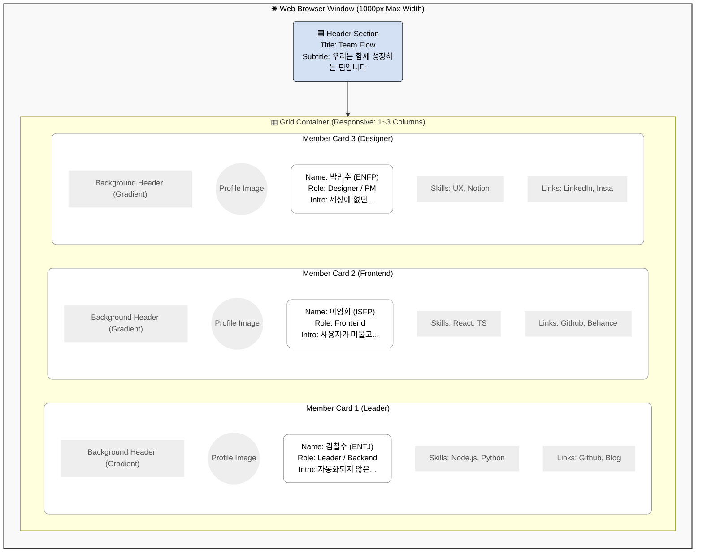

# 🖥️ 화면 설계서 (Screen Layout Design)

`index.html`로 구현된 웹페이지의 구조를 시각화한 설계도입니다.
Excalidraw 등에서 이 구조를 참고하여 와이어프레임을 그리실 수 있습니다.

## 1. 메인 페이지 구조 (Main Page Structure)

웹페이지는 크게 **헤더(Header)**와 **팀원 목록(Member Grid)**으로 나뉩니다.

## 2. 컴포넌트 상세 (Component Details)

각 카드는 다음과 같은 요소 배치로 구성됩니다. (Excalidraw 그리기용 가이드)

### 🪪 Member Card (카드 컴포넌트)
*   **크기**: 가로 300px 이상 (반응형으로 늘어남)
*   **배경**: 흰색 (#FFFFFF), 둥근 모서리 (Border Radius 20px)
*   **그림자**: 은은한 그림자 효과 (Box Shadow)

| 구역 (Zone) | 포함 요소 (Elements) | 스타일링 (Style) |
| :--- | :--- | :--- |
| **Top (30%)** | 그라데이션 배경 | `height: 120px`, Linear Gradient |
| **Middle (Profile)** | 원형 프로필 이미지 | `width: 100px`, 원형, 흰색 테두리 |
| **Content (Main)** | 이름, MBTI, 역할 | 이름(Big Bold), 역할(Badge Style) |
| **Body (Text)** | 한 줄 소개 | 회색 텍스트, 줄바꿈 허용 |
| **Footer (Info)** | SKILLS, PROJECTS, LINKS | 태그(Tag) 형태, 아이콘 링크 |

---
> 💡 **Tip**: Excalidraw에서 그릴 때, 큰 **사각형(Rectangle)** 안에 **원(Ellipse)**을 겹쳐서 프로필 사진을 표현하고, **작은 박스**들을 나열해 스킬 태그를 표현하면 됩니다.
